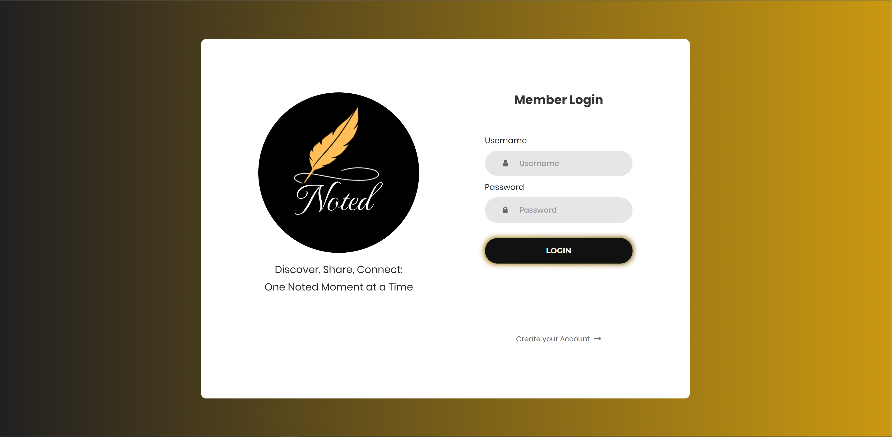
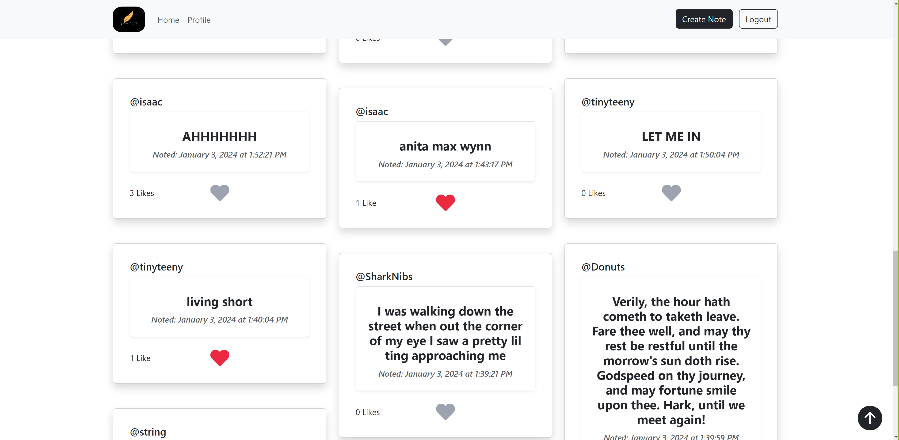

<!-- PROJECT LOGO -->
<br />
<div align="center">
  <a href="https://github.com/othneildrew/Best-README-Template">
    
  </a>

  <h1 align="center">Noted</h1>
  <h3 align="center">Capstone 3 Project</h3>
  <h4 align="center">A team project with the Year Up Application Devolpement Track</h4>
    <a href="https://github.com/perazae/Noted"><strong>Explore the docs »</strong></a>
    <br />
    <a href="#">View Demo</a> 

</div>

<!-- ABOUT THE PROJECT -->
## About The Project
In this project, we collaborated to build a "microblogging" website which allows users to share short insights with other users.

### Built With
* 
* [![Bootstrap][Bootstrap.com]][Bootstrap-url]
* [![JQuery][JQuery.com]][JQuery-url]
* 
* 

<!-- GETTING STARTED -->
### Prequisites

* Install Visual Studio Code
  ```sh
  https://code.visualstudio.com/
  ```
  * Use Base URL:
  http://microbloglite.us-east-2.elasticbeanstalk.com

### Features
* Login/Sign-Up
* Create a Post
* Delete a Post
* Like/Unlike a post
* View users' posts from the homepage with infinite scroll functionality
* Pinterest-style (masonry) layout for posts on the homepage
* Edit bio/fullname on profile of the logged-in user
* View friends with the friend list button on the profile page
* Visit other users' profile by clicking on their username

## Snapshots
### Login Page


### Post Page


### Profile Page


## Project Team Members
* Edson Peraza - [GitHub](https://github.com/perazae) 
* Derek Li - [GitHub](https://github.com/deli123) 
* Juan Espinoza - [GitHub](https://github.com/JuanEspinozaCode) 


[Bootstrap.com]: https://img.shields.io/badge/Bootstrap-563D7C?style=for-the-badge&logo=bootstrap&logoColor=white
[Bootstrap-url]: https://getbootstrap.com
[JQuery.com]: https://img.shields.io/badge/jQuery-0769AD?style=for-the-badge&logo=jquery&logoColor=white
[JQuery-url]: https://jquery.com 